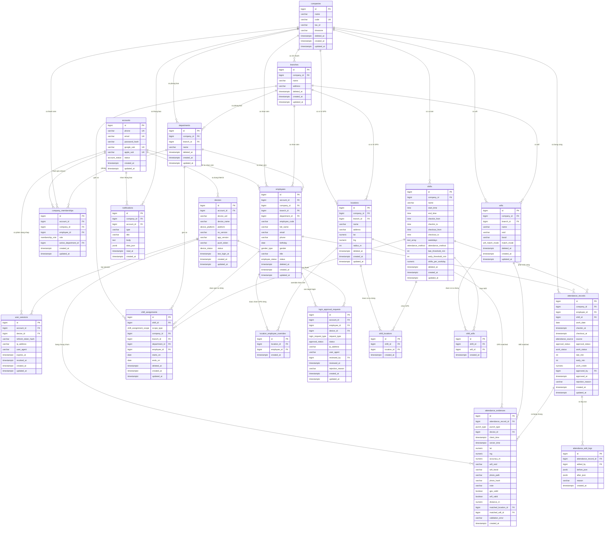
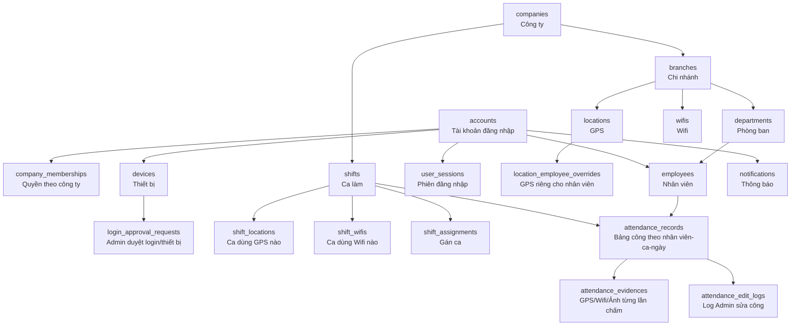
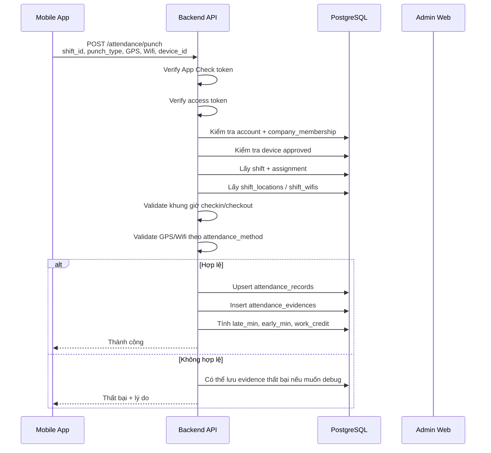
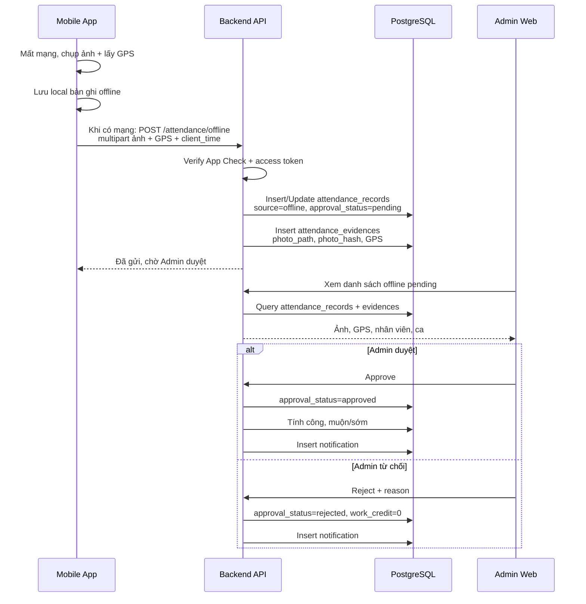
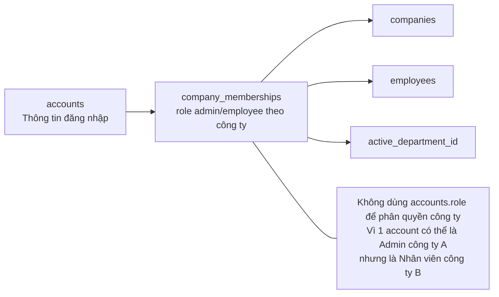
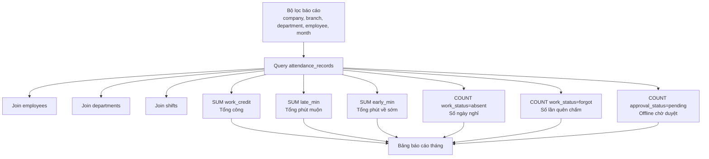
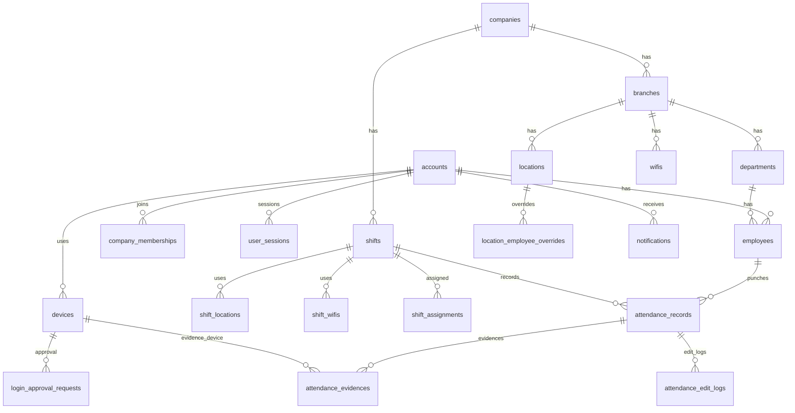

# Sơ đồ trực quan Database PostgreSQL — App Chấm Công

> Copy các đoạn **Mermaid** dưới đây vào nơi hỗ trợ Mermaid để xem trực quan:
>
> - VS Code cài extension: **Markdown Preview Mermaid Support**
> - Hoặc dùng web: https://mermaid.live
> - Hoặc GitHub/GitLab markdown cũng có thể hiển thị Mermaid.

---

## 1. Sơ đồ tổng quan database

---

## 2. Sơ đồ đơn giản hơn — nhìn luồng chính

---

## 3. Sơ đồ nghiệp vụ chấm công online

---

## 4. Sơ đồ nghiệp vụ chấm công offline

---

## 5. Sơ đồ phân quyền

---

## 6. Sơ đồ báo cáo tháng

---

## 7. Bản cực ngắn để copy nhanh vào Mermaid Live

Nếu chỉ muốn nhìn quan hệ chính, copy đoạn này:

---

## 8. Gợi ý công cụ trực quan hơn Mermaid

Nếu muốn kéo thả/nhìn database đẹp hơn, có thể dùng:

1. **dbdiagram.io**
   - Dễ nhìn ERD.
   - Có ngôn ngữ DBML.
   - Hợp để trình bày database.

2. **DrawSQL**
   - Đẹp, dễ share cho team.
   - Hợp thiết kế database dạng SaaS.

3. **DBeaver**
   - Kết nối PostgreSQL thật.
   - Generate ER Diagram từ database thật.

4. **DataGrip**
   - Mạnh, chuyên nghiệp.
   - Generate diagram tốt.

5. **pgAdmin**
   - Có ERD tool, nhưng giao diện không đẹp bằng dbdiagram/DrawSQL.

Khuyến nghị thực tế:

- Giai đoạn thiết kế: dùng **dbdiagram.io**.
- Khi có PostgreSQL thật: dùng **DBeaver** để generate ERD từ DB.