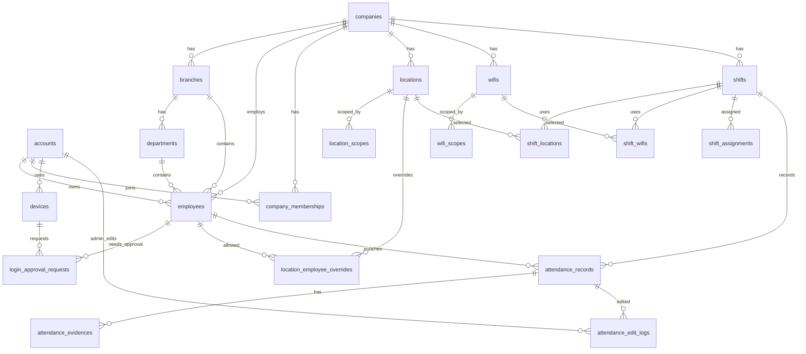

# Tai lieu Server, App Check va Database

> Pham vi: backend PHP cho he thong cham cong. Tai lieu nay mo ta stack server, App Check middleware, so do DB, SQL DDL va y nghia cac bang.

## 1. Stack server

| Hang muc | Cong nghe | Ghi chu |
|---|---|---|
| Backend | PHP 8.x | REST API JSON cho app nhan vien va web admin. |
| Database | MySQL/MariaDB | Luu cau truc cong ty, nhan vien, ca, GPS/Wifi, cham cong, duyet. |
| Upload | Local storage hoac S3-compatible storage | Luu anh cham cong offline. DB chi luu duong dan/hash/metadata. |
| Auth nguoi dung | Session/JWT rieng cua server | Xac dinh account, role Admin/Nhan vien, company context. |
| App Check | Firebase App Check | Bao ve API khoi client khong phai app hop le. Tai lieu: https://firebase.google.com/docs/app-check/custom-resource-backend |
| PHP Firebase SDK | Kreait Firebase Admin SDK for PHP | Dung `verifyToken()` cho App Check token neu moi truong ho tro. |

App Check va dang nhap la 2 lop rieng:

- App Check: request den tu app hop le.
- Auth server: request thuoc ve user nao, co quyen gi, trong cong ty nao.

Tat ca API app phai co:

```http
X-Firebase-AppCheck: <firebase_app_check_token>
Authorization: Bearer <server_access_token>
```

API login chua co `Authorization` nhung van phai co `X-Firebase-AppCheck`.

## 2. Middleware App Check trong PHP

Pseudo-code:

```php
<?php

use Kreait\Firebase\Factory;
use Kreait\Firebase\Exception\AppCheck\FailedToVerifyAppCheckToken;

final class AppCheckMiddleware
{
    public function __construct(private Factory $firebaseFactory) {}

    public function handle(Request $request, callable $next): Response
    {
        $token = $request->header('X-Firebase-AppCheck');

        if (!$token) {
            return Response::json(['message' => 'Missing App Check token'], 401);
        }

        try {
            $appCheck = $this->firebaseFactory->createAppCheck();
            $claims = $appCheck->verifyToken($token);
            $request->attributes->set('firebase_app_id', $claims->appId());
        } catch (FailedToVerifyAppCheckToken $e) {
            return Response::json(['message' => 'Invalid App Check token'], 401);
        }

        return $next($request);
    }
}
```

Neu moi truong PHP khong dung duoc Admin SDK, server can verify JWT App Check theo tai lieu Firebase custom backend: kiem tra header token, chu ky, issuer/audience/project, expiry va app id hop le.

## 3. So do DB



## 4. SQL DDL

```sql
CREATE TABLE accounts (
  id BIGINT UNSIGNED AUTO_INCREMENT PRIMARY KEY,
  phone VARCHAR(20) NOT NULL UNIQUE,
  email VARCHAR(190) NULL UNIQUE,
  pass VARCHAR(255) NULL,
  google_sub VARCHAR(190) NULL UNIQUE,
  apple_sub VARCHAR(190) NULL UNIQUE,
  role ENUM('admin','employee') NOT NULL DEFAULT 'employee',
  status ENUM('active','locked') NOT NULL DEFAULT 'active',
  created_at DATETIME NOT NULL DEFAULT CURRENT_TIMESTAMP,
  updated_at DATETIME NOT NULL DEFAULT CURRENT_TIMESTAMP ON UPDATE CURRENT_TIMESTAMP
);

CREATE TABLE companies (
  id BIGINT UNSIGNED AUTO_INCREMENT PRIMARY KEY,
  name VARCHAR(190) NOT NULL,
  code VARCHAR(60) NOT NULL UNIQUE,
  tax_id VARCHAR(60) NULL,
  created_at DATETIME NOT NULL DEFAULT CURRENT_TIMESTAMP,
  updated_at DATETIME NOT NULL DEFAULT CURRENT_TIMESTAMP ON UPDATE CURRENT_TIMESTAMP
);

CREATE TABLE branches (
  id BIGINT UNSIGNED AUTO_INCREMENT PRIMARY KEY,
  company_id BIGINT UNSIGNED NOT NULL,
  name VARCHAR(190) NOT NULL,
  address VARCHAR(255) NULL,
  created_at DATETIME NOT NULL DEFAULT CURRENT_TIMESTAMP,
  updated_at DATETIME NOT NULL DEFAULT CURRENT_TIMESTAMP ON UPDATE CURRENT_TIMESTAMP,
  FOREIGN KEY (company_id) REFERENCES companies(id)
);

CREATE TABLE departments (
  id BIGINT UNSIGNED AUTO_INCREMENT PRIMARY KEY,
  company_id BIGINT UNSIGNED NOT NULL,
  branch_id BIGINT UNSIGNED NOT NULL,
  name VARCHAR(190) NOT NULL,
  created_at DATETIME NOT NULL DEFAULT CURRENT_TIMESTAMP,
  updated_at DATETIME NOT NULL DEFAULT CURRENT_TIMESTAMP ON UPDATE CURRENT_TIMESTAMP,
  FOREIGN KEY (company_id) REFERENCES companies(id),
  FOREIGN KEY (branch_id) REFERENCES branches(id)
);

CREATE TABLE employees (
  id BIGINT UNSIGNED AUTO_INCREMENT PRIMARY KEY,
  account_id BIGINT UNSIGNED NOT NULL,
  company_id BIGINT UNSIGNED NOT NULL,
  branch_id BIGINT UNSIGNED NOT NULL,
  department_id BIGINT UNSIGNED NOT NULL,
  employee_code VARCHAR(60) NOT NULL,
  full_name VARCHAR(190) NOT NULL,
  email VARCHAR(190) NULL,
  phone VARCHAR(20) NOT NULL,
  birthday DATE NULL,
  gender ENUM('male','female','other') NULL,
  title VARCHAR(120) NULL,
  access_role ENUM('admin','employee') NOT NULL DEFAULT 'employee',
  status ENUM('active','locked','resigned') NOT NULL DEFAULT 'active',
  created_at DATETIME NOT NULL DEFAULT CURRENT_TIMESTAMP,
  updated_at DATETIME NOT NULL DEFAULT CURRENT_TIMESTAMP ON UPDATE CURRENT_TIMESTAMP,
  UNIQUE KEY uq_employee_company_code (company_id, employee_code),
  FOREIGN KEY (account_id) REFERENCES accounts(id),
  FOREIGN KEY (company_id) REFERENCES companies(id),
  FOREIGN KEY (branch_id) REFERENCES branches(id),
  FOREIGN KEY (department_id) REFERENCES departments(id)
);

CREATE TABLE company_memberships (
  id BIGINT UNSIGNED AUTO_INCREMENT PRIMARY KEY,
  account_id BIGINT UNSIGNED NOT NULL,
  company_id BIGINT UNSIGNED NOT NULL,
  employee_id BIGINT UNSIGNED NULL,
  role ENUM('admin','employee') NOT NULL DEFAULT 'employee',
  active_department_id BIGINT UNSIGNED NULL,
  created_at DATETIME NOT NULL DEFAULT CURRENT_TIMESTAMP,
  UNIQUE KEY uq_membership (account_id, company_id),
  FOREIGN KEY (account_id) REFERENCES accounts(id),
  FOREIGN KEY (company_id) REFERENCES companies(id),
  FOREIGN KEY (employee_id) REFERENCES employees(id),
  FOREIGN KEY (active_department_id) REFERENCES departments(id)
);

CREATE TABLE devices (
  id BIGINT UNSIGNED AUTO_INCREMENT PRIMARY KEY,
  account_id BIGINT UNSIGNED NOT NULL,
  device_uid VARCHAR(190) NOT NULL,
  device_name VARCHAR(190) NULL,
  platform ENUM('ios','android') NOT NULL,
  os_version VARCHAR(60) NULL,
  app_version VARCHAR(60) NULL,
  push_token VARCHAR(255) NULL,
  status ENUM('pending','approved','rejected','revoked') NOT NULL DEFAULT 'pending',
  last_login_at DATETIME NULL,
  created_at DATETIME NOT NULL DEFAULT CURRENT_TIMESTAMP,
  updated_at DATETIME NOT NULL DEFAULT CURRENT_TIMESTAMP ON UPDATE CURRENT_TIMESTAMP,
  UNIQUE KEY uq_account_device (account_id, device_uid),
  FOREIGN KEY (account_id) REFERENCES accounts(id)
);

CREATE TABLE login_approval_requests (
  id BIGINT UNSIGNED AUTO_INCREMENT PRIMARY KEY,
  account_id BIGINT UNSIGNED NOT NULL,
  employee_id BIGINT UNSIGNED NULL,
  device_id BIGINT UNSIGNED NOT NULL,
  request_type ENUM('new_login','new_device') NOT NULL,
  status ENUM('pending','approved','rejected') NOT NULL DEFAULT 'pending',
  ip_address VARCHAR(60) NULL,
  user_agent VARCHAR(255) NULL,
  reviewed_by BIGINT UNSIGNED NULL,
  reviewed_at DATETIME NULL,
  created_at DATETIME NOT NULL DEFAULT CURRENT_TIMESTAMP,
  FOREIGN KEY (account_id) REFERENCES accounts(id),
  FOREIGN KEY (employee_id) REFERENCES employees(id),
  FOREIGN KEY (device_id) REFERENCES devices(id),
  FOREIGN KEY (reviewed_by) REFERENCES accounts(id)
);

CREATE TABLE locations (
  id BIGINT UNSIGNED AUTO_INCREMENT PRIMARY KEY,
  company_id BIGINT UNSIGNED NOT NULL,
  name VARCHAR(190) NOT NULL,
  address VARCHAR(255) NULL,
  lat DECIMAL(10,7) NOT NULL,
  lng DECIMAL(10,7) NOT NULL,
  radius_m INT UNSIGNED NOT NULL DEFAULT 80,
  created_at DATETIME NOT NULL DEFAULT CURRENT_TIMESTAMP,
  updated_at DATETIME NOT NULL DEFAULT CURRENT_TIMESTAMP ON UPDATE CURRENT_TIMESTAMP,
  FOREIGN KEY (company_id) REFERENCES companies(id)
);

CREATE TABLE location_scopes (
  id BIGINT UNSIGNED AUTO_INCREMENT PRIMARY KEY,
  location_id BIGINT UNSIGNED NOT NULL,
  branch_id BIGINT UNSIGNED NULL,
  department_id BIGINT UNSIGNED NULL,
  FOREIGN KEY (location_id) REFERENCES locations(id),
  FOREIGN KEY (branch_id) REFERENCES branches(id),
  FOREIGN KEY (department_id) REFERENCES departments(id)
);

CREATE TABLE location_employee_overrides (
  id BIGINT UNSIGNED AUTO_INCREMENT PRIMARY KEY,
  location_id BIGINT UNSIGNED NOT NULL,
  employee_id BIGINT UNSIGNED NOT NULL,
  created_at DATETIME NOT NULL DEFAULT CURRENT_TIMESTAMP,
  UNIQUE KEY uq_location_employee (location_id, employee_id),
  FOREIGN KEY (location_id) REFERENCES locations(id),
  FOREIGN KEY (employee_id) REFERENCES employees(id)
);

CREATE TABLE wifis (
  id BIGINT UNSIGNED AUTO_INCREMENT PRIMARY KEY,
  company_id BIGINT UNSIGNED NOT NULL,
  ssid VARCHAR(190) NOT NULL,
  bssid VARCHAR(60) NULL,
  match_mode ENUM('ssid','ssid_bssid') NOT NULL DEFAULT 'ssid_bssid',
  created_at DATETIME NOT NULL DEFAULT CURRENT_TIMESTAMP,
  updated_at DATETIME NOT NULL DEFAULT CURRENT_TIMESTAMP ON UPDATE CURRENT_TIMESTAMP,
  FOREIGN KEY (company_id) REFERENCES companies(id)
);

CREATE TABLE wifi_scopes (
  id BIGINT UNSIGNED AUTO_INCREMENT PRIMARY KEY,
  wifi_id BIGINT UNSIGNED NOT NULL,
  branch_id BIGINT UNSIGNED NULL,
  department_id BIGINT UNSIGNED NULL,
  FOREIGN KEY (wifi_id) REFERENCES wifis(id),
  FOREIGN KEY (branch_id) REFERENCES branches(id),
  FOREIGN KEY (department_id) REFERENCES departments(id)
);

CREATE TABLE shifts (
  id BIGINT UNSIGNED AUTO_INCREMENT PRIMARY KEY,
  company_id BIGINT UNSIGNED NOT NULL,
  name VARCHAR(190) NOT NULL,
  start_time TIME NOT NULL,
  end_time TIME NOT NULL,
  checkin_from TIME NOT NULL,
  checkin_to TIME NOT NULL,
  weekdays SET('mon','tue','wed','thu','fri','sat','sun') NOT NULL,
  attendance_method ENUM('gps','wifi','gps_wifi') NOT NULL,
  late_threshold_min INT UNSIGNED NOT NULL DEFAULT 0,
  early_threshold_min INT UNSIGNED NOT NULL DEFAULT 0,
  shifts_per_workday DECIMAL(5,2) NOT NULL DEFAULT 1.00,
  created_at DATETIME NOT NULL DEFAULT CURRENT_TIMESTAMP,
  updated_at DATETIME NOT NULL DEFAULT CURRENT_TIMESTAMP ON UPDATE CURRENT_TIMESTAMP,
  FOREIGN KEY (company_id) REFERENCES companies(id)
);

CREATE TABLE shift_locations (
  id BIGINT UNSIGNED AUTO_INCREMENT PRIMARY KEY,
  shift_id BIGINT UNSIGNED NOT NULL,
  location_id BIGINT UNSIGNED NOT NULL,
  UNIQUE KEY uq_shift_location (shift_id, location_id),
  FOREIGN KEY (shift_id) REFERENCES shifts(id),
  FOREIGN KEY (location_id) REFERENCES locations(id)
);

CREATE TABLE shift_wifis (
  id BIGINT UNSIGNED AUTO_INCREMENT PRIMARY KEY,
  shift_id BIGINT UNSIGNED NOT NULL,
  wifi_id BIGINT UNSIGNED NOT NULL,
  UNIQUE KEY uq_shift_wifi (shift_id, wifi_id),
  FOREIGN KEY (shift_id) REFERENCES shifts(id),
  FOREIGN KEY (wifi_id) REFERENCES wifis(id)
);

CREATE TABLE shift_assignments (
  id BIGINT UNSIGNED AUTO_INCREMENT PRIMARY KEY,
  shift_id BIGINT UNSIGNED NOT NULL,
  scope_type ENUM('company','branch','department','employee') NOT NULL,
  company_id BIGINT UNSIGNED NOT NULL,
  branch_id BIGINT UNSIGNED NULL,
  department_id BIGINT UNSIGNED NULL,
  employee_id BIGINT UNSIGNED NULL,
  starts_on DATE NULL,
  ends_on DATE NULL,
  created_at DATETIME NOT NULL DEFAULT CURRENT_TIMESTAMP,
  FOREIGN KEY (shift_id) REFERENCES shifts(id),
  FOREIGN KEY (company_id) REFERENCES companies(id),
  FOREIGN KEY (branch_id) REFERENCES branches(id),
  FOREIGN KEY (department_id) REFERENCES departments(id),
  FOREIGN KEY (employee_id) REFERENCES employees(id)
);

CREATE TABLE attendance_records (
  id BIGINT UNSIGNED AUTO_INCREMENT PRIMARY KEY,
  company_id BIGINT UNSIGNED NOT NULL,
  employee_id BIGINT UNSIGNED NOT NULL,
  shift_id BIGINT UNSIGNED NOT NULL,
  work_date DATE NOT NULL,
  checkin_at DATETIME NULL,
  checkout_at DATETIME NULL,
  source ENUM('online','offline','admin_edit') NOT NULL DEFAULT 'online',
  status ENUM('pending','valid','rejected','forgot','absent') NOT NULL DEFAULT 'valid',
  late_min INT UNSIGNED NOT NULL DEFAULT 0,
  early_min INT UNSIGNED NOT NULL DEFAULT 0,
  work_credit DECIMAL(6,2) NOT NULL DEFAULT 0.00,
  approved_by BIGINT UNSIGNED NULL,
  approved_at DATETIME NULL,
  rejection_reason VARCHAR(255) NULL,
  created_at DATETIME NOT NULL DEFAULT CURRENT_TIMESTAMP,
  updated_at DATETIME NOT NULL DEFAULT CURRENT_TIMESTAMP ON UPDATE CURRENT_TIMESTAMP,
  UNIQUE KEY uq_attendance_employee_shift_date (employee_id, shift_id, work_date),
  FOREIGN KEY (company_id) REFERENCES companies(id),
  FOREIGN KEY (employee_id) REFERENCES employees(id),
  FOREIGN KEY (shift_id) REFERENCES shifts(id),
  FOREIGN KEY (approved_by) REFERENCES accounts(id)
);

CREATE TABLE attendance_evidences (
  id BIGINT UNSIGNED AUTO_INCREMENT PRIMARY KEY,
  attendance_record_id BIGINT UNSIGNED NOT NULL,
  punch_type ENUM('in','out') NOT NULL,
  device_id BIGINT UNSIGNED NULL,
  client_time DATETIME NOT NULL,
  lat DECIMAL(10,7) NULL,
  lng DECIMAL(10,7) NULL,
  accuracy_m DECIMAL(8,2) NULL,
  wifi_ssid VARCHAR(190) NULL,
  wifi_bssid VARCHAR(60) NULL,
  photo VARCHAR(255) NULL,
  note VARCHAR(255) NULL,
  gps_valid TINYINT(1) NOT NULL DEFAULT 0,
  wifi_valid TINYINT(1) NOT NULL DEFAULT 0,
  created_at DATETIME NOT NULL DEFAULT CURRENT_TIMESTAMP,
  FOREIGN KEY (attendance_record_id) REFERENCES attendance_records(id),
  FOREIGN KEY (device_id) REFERENCES devices(id)
);

CREATE TABLE attendance_edit_logs (
  id BIGINT UNSIGNED AUTO_INCREMENT PRIMARY KEY,
  attendance_record_id BIGINT UNSIGNED NOT NULL,
  edited_by BIGINT UNSIGNED NOT NULL,
  before_json JSON NULL,
  after_json JSON NOT NULL,
  reason VARCHAR(255) NOT NULL,
  created_at DATETIME NOT NULL DEFAULT CURRENT_TIMESTAMP,
  FOREIGN KEY (attendance_record_id) REFERENCES attendance_records(id),
  FOREIGN KEY (edited_by) REFERENCES accounts(id)
);
```

## 5. Giai thich DB

| Bang | Muc dich | Quan he chinh | Ghi chu nghiep vu |
|---|---|---|---|
| `accounts` | Tai khoan dang nhap he thong. | 1 account co the co nhieu employee o nhieu cong ty. | Luu phone/password hash va dinh danh Google/Apple neu co. |
| `companies` | Cong ty. | Co nhieu branch, employee, shift. | 1 tai khoan co the thuoc nhieu cong ty qua membership. |
| `branches` | Chi nhanh. | Thuoc company, co nhieu department/employee. | Dung de loc nhan su, GPS, Wifi, bao cao. |
| `departments` | Phong/bo phan. | Thuoc branch, co nhieu employee. | Moi lan dang nhap tai khoan chi o 1 phong active. |
| `employees` | Ho so nhan vien trong cong ty. | Noi account voi company/branch/department. | Chua ma NV, SĐT, email, ngay sinh, gioi tinh, chuc vu, quyen. |
| `company_memberships` | Tai khoan tham gia cong ty nao. | Noi account-company-employee. | Luu `active_department_id` de phuc vu chuyen cong ty/phong. |
| `devices` | Thiet bi dang nhap. | Thuoc account. | Thiet bi moi mac dinh pending, can Admin duyet. |
| `login_approval_requests` | Yeu cau xac nhan dang nhap/thiet bi. | Noi account, employee, device va admin duyet. | Admin duyet/từ choi truoc khi cho vao app. |
| `locations` | Danh muc vi tri GPS. | Thuoc company. | Luu lat/lng/radius, dung de doi chieu cham cong. |
| `location_scopes` | Pham vi ap dung GPS. | Noi location voi branch/department. | Cho phep 1 vi tri ap dung nhieu chi nhanh/phong. |
| `location_employee_overrides` | Gan GPS rieng cho ca nhan. | Noi location voi employee. | Dung cho nhan vien di cong tac duoc cham o nhieu noi. |
| `wifis` | Danh muc Wifi. | Thuoc company. | Doi chieu theo SSID hoac SSID + BSSID. |
| `wifi_scopes` | Pham vi ap dung Wifi. | Noi wifi voi branch/department. | Dung khi ca chon chi Wifi hoac GPS + Wifi. |
| `shifts` | Cau hinh ca lam. | Thuoc company. | Luu gio vao/ra, khung cham, ngay trong tuan, nguong muon/som, so ca = 1 cong. |
| `shift_locations` | GPS duoc dung cho ca. | Noi shift-location. | Ca chon GPS hoac GPS + Wifi can co location. |
| `shift_wifis` | Wifi duoc dung cho ca. | Noi shift-wifi. | Ca chon Wifi hoac GPS + Wifi can co wifi. |
| `shift_assignments` | Gan ca. | Gan theo company/branch/department/employee. | 1 nhan vien co the co nhieu ca. |
| `attendance_records` | Ban ghi cham cong theo nhan vien-ca-ngay. | Noi employee, shift, company. | Luu checkin/checkout, trang thai, phut muon/som, cong tinh duoc. |
| `attendance_evidences` | Bang chung cho moi lan cham. | Thuoc attendance_record. | Luu GPS, Wifi, anh offline, device, ket qua doi chieu. |
| `attendance_edit_logs` | Lich su Admin sua cham cong. | Thuoc attendance_record va account admin. | Moi chinh sua phai luu before/after va ly do. |

## 6. Quy tac server can ap dung

- Neu `attendance_method = gps`, request hop le khi GPS nam trong it nhat 1 location duoc phep.
- Neu `attendance_method = wifi`, request hop le khi Wifi khop it nhat 1 wifi duoc phep.
- Neu `attendance_method = gps_wifi`, request chi hop le khi ca GPS va Wifi deu dung.
- Cham offline luon tao `attendance_records.source = offline`, `status = pending`, co `attendance_evidences.photo`, `lat`, `lng`; chi tinh cong sau khi Admin duyet.
- Ban ghi co checkin nhung khong co checkout thi tinh `forgot`.
- Ngay co ca duoc gan nhung khong co checkin thi tinh `absent`.
- 1 ca duoc tinh cong khi co ca checkin va checkout hop le. Cong = `1 / shifts_per_workday` cho moi ca hop le.
- Admin sua cham cong phai tao `attendance_edit_logs` va cap nhat lai phut muon/som, trang thai, cong.
- Xuat bao cao theo thang lay tu `attendance_records`, loc theo company hoac department; khi chon 1 nhan vien thi hien lich su cham cong tung ngay trong thang.
